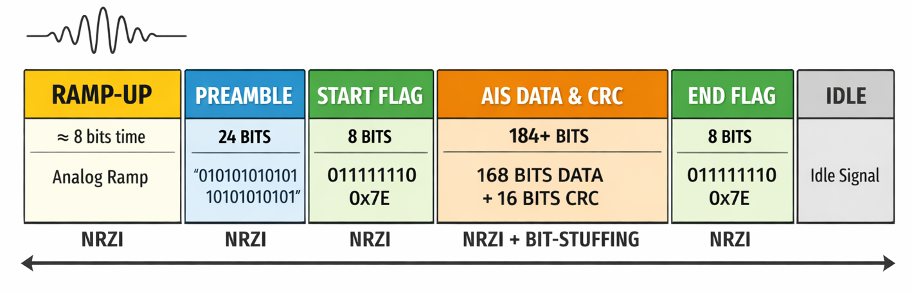
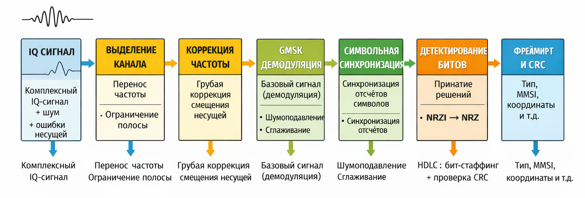
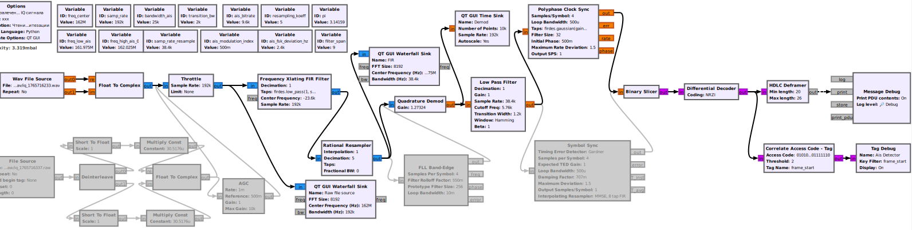

# Извлечение AIS пакета из IQ сигнала в [GRC](https://www.gnuradio.org/) на базе стандартных компонент (блоков)
- [Извлечение AIS пакета из IQ сигнала в GRC на базе стандартных компонент (блоков)](#извлечение-ais-пакета-из-iq-сигнала-в-grc-на-базе-стандартных-компонент-блоков)
  - [Постановка задачи](#постановка-задачи)
  - [Окружение](#окружение)
    - [Софт](#софт)
  - [Вводная](#вводная)
  - [Подбираемся к декодированию AIS](#подбираемся-к-декодированию-ais)
    - [Общие свойства передачи AIS](#общие-свойства-передачи-ais)
    - [Структура AIS сигнала в эфире](#структура-ais-сигнала-в-эфире)
      - [1 RAMP (нарастание мощности)](#1-ramp-нарастание-мощности)
      - [2 ПРЕАМБУЛА](#2-преамбула)
      - [3 HDLC-ФЛАГ начальный](#3-hdlc-флаг-начальный)
      - [4 Битовый поток между флагами](#4-битовый-поток-между-флагами)
      - [4.1 AIS DATA + PADDING](#41-ais-data--padding)
      - [4.2 CRC (FCS)](#42-crc-fcs)
      - [5 HDLC-ФЛАГ конечный](#5-hdlc-флаг-конечный)
  - [Блок-схема декодирования AIS](#блок-схема-декодирования-ais)
    - [1. Входной радиосигнал](#1-входной-радиосигнал)
    - [2. Выделение AIS канала](#2-выделение-ais-канала)
    - [3. Грубая коррекция несущей (carrier frequency recovery)](#3-грубая-коррекция-несущей-carrier-frequency-recovery)
    - [4. Демодуляция GMSK](#4-демодуляция-gmsk)
    - [5. Фильтрация базовой полосы](#5-фильтрация-базовой-полосы)
    - [6. Символьная синхронизация (clock recovery)](#6-символьная-синхронизация-clock-recovery)
    - [7. Детектирование битов](#7-детектирование-битов)
    - [8. Декодирование NRZI](#8-декодирование-nrzi)
    - [9. Дефрейминг и проверка целостности](#9-дефрейминг-и-проверка-целостности)
    - [10. Интерпретация AIS-сообщения](#10-интерпретация-ais-сообщения)
  - [Реализация декодирования AIS в GRC](#реализация-декодирования-ais-в-grc)
  - [Из особенностей отладки:](#из-особенностей-отладки)
  - [TDOO](#tdoo)
  - [Полезные ссылки](#полезные-ссылки)

## Постановка задачи 
1. Разобраться в принципах работы в [GRC](https://www.gnuradio.org/) (на начало 2026 в РФ сайт не работает без VPN)
2. Провести эксперименты с демодуляцией GMSK
3. Провести извлечение пакетов AIS без дополнительного кода

## Окружение 
### Софт
* Операционная система Ubuntu Ubuntu 24.04.3 LTS
* GNU Radio v3.10.9.2 (Python 3.12.3)

## Вводная
Значительная часть работы строилась в режиме диалогов с [GPT 5](https://chatgpt.com/), [Deepseek](https://chat.deepseek.com/) и [Prism](https://prism.openai.com) (надстройка над GPT для научных работ, более строгая, чуть меньше галлюцинаций). Данные LLM давали наиболее релевантный результат по сравнению с [Perplexity](https://www.perplexity.ai/), [Qwen](https://chat.qwen.ai/), [Ernie](https://ernie.baidu.com/) и [ГигаЧат](https://giga.chat/) (наихудший результат, очень мало "знаний"). 

Забегая вперёд, даже простые манипуляции с битами всем LLM давались очень сложно и далеко не с первого раза, если вообще получилось. Например, промт вида: "декодируй AIS пакет и дай в читаемом виде информацию из битовой строки AIS сообщения 010...101, контрольная сумма проверена, бит-стаффинг сделан, флаги удалены, используй описание стандарта AIS, рассуждай пошагово с самопроверкой каждого шага" с корректной битовой последовательностью давал совершенно разные результаты в разных LLM, даже, казалось, в простых и однозначных параметрах как [MMSI](http://amcsailing.ru/glossarij/26.html), GPS-координат и тп

Неплохо LLM рассказывали как в целом работать в GRC, про специфику того или иного компонента. Конечно, и тут не обходилось без галлюцинаций, когда стандартному компоненту GRC LLM приписывала несуществующие параметры, но путем уточнения и перечисления вручную корректных параметров компонента консенсус чаще всего достигался. Так же помогала кросс-проверка одного и того же в разных LLM. На короткие простые вопросы выручал ИИ режим Google.

В качестве первых шагов в GRC могу порекомендовать посмотреть серию роликов отличного радиоблогера [Алексея Игонина](https://rutube.ru/video/8f4760a4d8630b4b73eb5d25046c898b/) по теме GNU Radio.

## Подбираемся к декодированию AIS
Итак, считаем, что у нас уже есть [записанный IQ сигнал AIS](../rec/README.md) и нам нужно извлечь из него AIS пакет.

### Общие свойства передачи AIS
* Физический уровень: два канала 161,975 МГц и 162,025 МГц, модуляця GMSK с BT=0,5, битрейт 9600 бит/с, девиация частоты 2,4 кГц = 0,5*9600/2, длительность пакета ~26 мс
* Линейное кодирование: [NRZI](https://ru.wikipedia.org/wiki/NRZI)
* Порядок передачи бит: LSB-first
* Обнаружение кадров: [HDLC-подобное фреймирование](https://ciscotips.ru/hdlc) флагом 0х7E
* [Бит-стаффинг (bit-staffing)](https://ru.wikipedia.org/wiki/Положительное_выравнивание) для данных пакета
* Обнаружение ошибок: контрольная сумма CRC-16, алгоритм CCITT/X-25

### Структура AIS сигнала в эфире

Рис 1. Сигнал AIS. Изображение сгенерировано ChatGPT

#### 1 RAMP (нарастание мощности)
* ~8 бит по времени (не битовое поле), т.е. ~8 мс
* Аналоговый участок сигнала
* Предназначен для стабилизации передатчика и захвата частоты и уровня на приёме
* Не является частью битового потока
* Не участвует: в NRZI/в bit-stuffing/в CRC

#### 2 ПРЕАМБУЛА
* 24 бита: 010101010101010101010101
* Передаётся LSB-first
* Подвергается NRZI
* НЕ подвергается bit-stuffing
* Назначение: захват символьной синхронизации
* Не участвует в CRC

#### 3 HDLC-ФЛАГ начальный
* 8 бит: 0x7E  (01111110, LSB-first)
* Подвергается NRZI
* НЕ подвергается bit-stuffing
* Является маркером начала кадра
* После него: включается bit-stuffing и начинается полезная нагрузка

#### 4 Битовый поток между флагами
[AIS DATA + PADDING] + [CRC] 

#### 4.1 AIS DATA + PADDING
* 168 бит (21 байт): до bit-stuffing данных AIS сообщение может дополняться (padding) нулями от 0 до 7 нулей до размера 168 бит
* Включает: Message Type (6 бит), Repeat Indicator (2 бита), MMSI (30 бит), остальные поля — по типу сообщения
* Не включает CRC
* Подвергается NRZI
* Подвергается bit-stuffing
* Используется для расчёта CRC

#### 4.2 CRC (FCS)
* 16 бит
* алгоритм расчета CRC-16-CCITT / X-25
* полином: 0x1021
* Инициализация: 0xFFFF
* Отражение на входе: true
* Отражение на выходе: true
* XOR на выходе: 0xFFFF
* Считается только по 168 битам [AIS DATA + PADDING]
* Передаётся LSB-first
* Подвергается NRZI
* Подвергается bit-stuffing

#### 5 HDLC-ФЛАГ конечный
* 8 бит: 0x7E  (01111110, LSB-first)
* Подвергается NRZI
* НЕ подвергается bit-stuffing
* Является маркером завершения кадра

## Блок-схема декодирования AIS

Рис 1. Блок-схема извлечения AIS пакета из IQ сигнала. Изображение сгенерировано ChatGPT

### 1. Входной радиосигнал
* Вход: комплексный IQ-сигнал, захваченный в районе 162 МГц и шириной несколько сот кГц
* Содержит:
    * полезный AIS-сигнал (GMSK) от двух AIS каналов
    * шум
    * возможные отражения (многолучёвость)
    * частотную ошибку (приёмник + передатчик)
* Физический смысл: это «сырая» полоса вокруг 162 МГц, перенесённая в ноль

### 2. Выделение AIS канала 
* Задача: выделить один AIS-канал из общей полосы
* Операции:
    * перенос спектра нужного канала к нулевой частоте
    * ограничение полосы (отсечение второго AIS-канала и шума)
* Результат: комплексный сигнал одного AIS-канала всё ещё с частотной ошибкой (несколько сотен Гц – кГц)

### 3. Грубая коррекция несущей (carrier frequency recovery)
* Задача: убрать остаточное смещение частоты несущей
* Что компенсируется:
    * дрейф приёмника
    * дрейф передатчика
    * ошибка настройки центра канала
* Физический смысл: привести центр GMSK-спектра к 0 Гц
* Не восстанавливается фаза, только частота
* Результат: комплексный сигнал GMSK с минимальным частотным сдвигом

### 4. Демодуляция GMSK
* Задача: преобразовать фазовую модуляцию в базовый сигнал
* Физический смысл:
    * Изменения фазы → изменения мгновенной частоты
    * Получение непрерывного базового сигнала (FM baseband)
* Результат: вещественный сигнал, форма символов ещё «размазана» по времени

### 5. Фильтрация базовой полосы
* Задача: 
    * подавить шум вне полезной полосы
    * улучшить отношение сигнал/шум перед принятием решений
* Физический смысл:
    * Сглаживание демодулированного сигнала
    * Частичное восстановление формы символов

### 6. Символьная синхронизация (clock recovery)
* Задача: найти правильные моменты времени для считывания битов
* Компенсируется:
    * несовпадение частоты дискретизации
    * дробное рассогласование тактов
    * джиттер
    * многолучевые искажения
* Результат: сигнал, отсчитанный строго по символам

### 7. Детектирование битов
* Задача: принять решение «0» или «1» для каждого символа
* Результат: двоичный поток в коде NRZI

### 8. Декодирование NRZI
* Задача: восстановить исходный битовый поток
* Физический смысл: устранение дифференциального кодирования

### 9. Дефрейминг и проверка целостности
* Задача: 
    * найти границы пакета по флагам 0х7E
    * удалить бит-стаффинг
    * проверить CRC
* Результат: целостный кадр данных AIS

### 10. Интерпретация AIS-сообщения
* Задача: побитово разобрать поле данных
* Получить:
    * тип сообщения
    * MMSI
    * координаты
    * скорость
    * курс
    * время и т.п.

## Реализация декодирования AIS в GRC

Рис 3. Пайплайн извлечения AIS пакета в GRC

Готовый пайплан для GRC v3.10.9.2 (Python 3.12.3) [тут](src/read_bin_iq.grc)

## Из особенностей отладки:
* Мой экземпляр Малахита немного увеличивает частоту отображаемого сигнала, погрешность порядка 2 кГц на частоте сигнала 162,00000 МГц. Как следствие, в компоненте FIR смещение частоты (параметр Center frequency) использую не ровно -25,0 кГц, а -23,0 кГц. Да, я подавал сигнал с генератора на точный частотомер и на Малахит
* очень короткие ~26 мс пакеты AIS на фоне длительной "тишины" эфира, сложно настроить триггер осциллографа
* уровень сигнала на выходе GMSK демодулятора в 3-5 раза меньше (!) при наличии полезного сигнала по сравнению с шумом эфира, что может быть неожиданным для новичка
* существенное количество настраиваемых параметров в разных компонентах, влияющих на конечный результат декодирования
* компонент Polyphase Clock Sync ощутимо лучше (больше принятых валидных пакетов AIS) восстанавливает биты, чем компонент Symbol sync
* добавление автоподстройки усиления (компонент AGC) улучшений не дает в моем случае
* понимание конкретного алгоритма расчета CRC-16 в пакете AIS: по факту используется подвид CRC-16/CCITT с названием CRC-16 X.25 (синонимы: CRC-16/X-25, CRC-16/IBM-SDLC, CRC-16-QT, CRC-B)
* понимание порядка упаковки бит в байте и байт в многобайтовых пакетах: в AIS используется порядок LSB (младший бит или байт передается первым)

## TDOO
1. С наскоку не получилось сделать автоподстройку частоты/фазы для устранения неточностей и дрейфа частот передатчика/приемника. Были эксперименты с компонентами FLL Band Edge и PLL Frequency Detector, но без явных улучшений характеристик схемы. Один из инженерных подходов без сложных цепей обратной связи - создание нескольких параллельных пайплайнов с небольшим шагом по частоте в пределах 100-500 Гц при условии достаточно мощного CPU для их обработки в реальном времени. Небольшой дрейф в пределах 100-200 Гц нивелирует сам Polyphase Clock Sync. Опять же особенность - подобная автоподстройка должна работать очень быстро за время прохождения преамбулы (24 бита, около 2,5 мс) + детекция, что это именно преамбула, а не шум.
1. В практических не учебных схемах не рекомендуется использовать компонент Throttle, так как он вносит дополнительный джиттер из за нестабильности планировщика.

## Полезные ссылки
1. [Wiki AIS](https://ru.wikipedia.org/wiki/Автоматическая_идентификационная_система)
2. [Wiki GNU Radio](https://wiki.gnuradio.org)
3. [А. Игонин. GNURadio - SDR конструктор. Часть 1. Введение.](https://rutube.ru/video/8f4760a4d8630b4b73eb5d25046c898b/)
4. [А. Игонин. GNURadio - SDR конструктор. Часть 2. Первые эксперименты. Источники и получатели. Азы ЦОС.](https://rutube.ru/video/968ad4fe1f2159cf28c94a69d1d6accf/)
5. [А. Игонин. GNURadio - SDR конструктор. Часть 3. Простейший FM SDR приёмник. Азы ЦОС.](https://rutube.ru/video/df18d07b107452f7da7465d120940f4e/)
6. [Перехватываем и разбираем сигнал AIS](https://xakep.ru/2024/09/12/decoding-ais/)
7. [AIS on SDR](https://github.com/freerange/ais-on-sdr)
8. [Описание протокола AIS](https://gpsd.gitlab.io/gpsd/AIVDM.html)
9. [Создание приемника FM на RTL-SDR с помощью GNU Radio Companion](http://microsin.net/adminstuff/others/rtl-sdr-fm-radio-receiver-with-gnu-radio-companion.html)
10. Онлайн калькулятор CRC [один](https://crccalc.com/?crc=123456789&method=CRC-16&datatype=ascii&outtype=hex) и [второй](https://www.sunshine2k.de/coding/javascript/crc/crc_js.html)