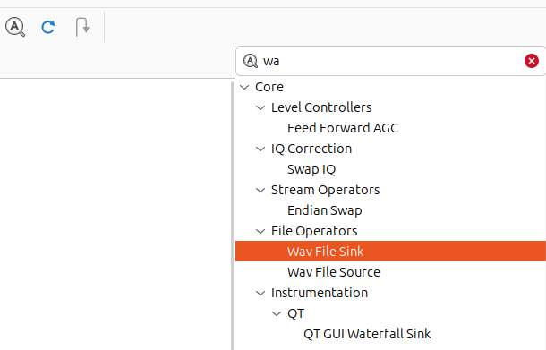

## Запись IQ сигнала с приемника [Малахит DSP3](https://malahiteam.com/product/priemnik-malahit-dsp3/)
### Способы
#### 1. Запись с помощью [ALSA](https://help.ubuntu.ru/wiki/alsa)
#### 2. Запись с помощью [GRC (GNU Radio)](https://www.gnuradio.org/)
#### 3. Запись с помощью SDR программ 

### Подключить приемник к компьютеру через USB
При подключении приемника [Малахит DSP3](https://malahiteam.com/product/priemnik-malahit-dsp3/) через USB операционная система (точнее, [ALSA](https://help.ubuntu.ru/wiki/alsa) в Ububntu в моем случае) определит несколько устройств для ввода (захвата, capture) и вывода звука. Сам приемник должен быть при этом включен. Малахит выдает помимо обычного WAV еще и IQ сигнал с частотой дискретизации 192 кГц в режиме стерео: левый канал - I, правый - Q. С помощью PulseAudio или аналогичных программ для управления аудиопотоками можно, например, направить вывод системных звуков на динамик Малахита (устройство Malahit reciever).

### 0. Общее. Определить устройство для захвата IQ сигнала с приемника
После подключения по USB в терминале выполнить команды:
```bash
arecord -l

**** Список CAPTURE устройств ****
карта 1: Audio [Cmedia Audio], устройство 0: USB Audio [USB Audio]
  Подустройства: 1/1
  Подустройство №0: subdevice #0
карта 3: reciever [Malahit reciever], устройство 0: USB Audio [USB Audio]
  Подустройства: 1/1
  Подустройство №0: subdevice #0
карта 3: reciever [Malahit reciever], устройство 1: USB Audio [USB Audio #1]
  Подустройства: 1/1
  Подустройство №0: subdevice #0
```

Посмотреть более детальную информацию о карте 3 устройство 1 (hw:3,1):
```bash
arecord --device="hw:3,1" --dump-hw-params
Warning: Some sources (like microphones) may produce inaudible results
         with 8-bit sampling. Use '-f' argument to increase resolution
         e.g. '-f S16_LE'.
HW Params of device "hw:3,1":
--------------------
ACCESS:  MMAP_INTERLEAVED RW_INTERLEAVED
FORMAT:  S16_LE
SUBFORMAT:  STD MSBITS_MAX
SAMPLE_BITS: 16
FRAME_BITS: 32
CHANNELS: 2
RATE: 192000
PERIOD_TIME: [1000 1000000]
PERIOD_SIZE: [192 192000]
PERIOD_BYTES: [768 768000]
PERIODS: [2 1024]
BUFFER_TIME: [2000 2000000]
BUFFER_SIZE: [384 384000]
BUFFER_BYTES: [1536 1536000]
TICK_TIME: ALL
--------------------
arecord: set_params:1371: Остсутствует частота оцифровки
Available formats:
- S16_LE
```
Обращаем внимание на параметры `RATE: 192000` и `CHANNELS: 2` - это частота дискретизации 192 кГц и количество каналов - два. У второго устройства в моем случае частота дискретизации составляет 48 кГц и 1 канал (моно). Значит данное устройство `hw:3,1` (или более детально `hw:CARD=reciever,DEV=1`) похоже на то, что мы ищем для записи IQ сигнала.

### 1. Запись IQ сигнала с помощью [ALSA](https://help.ubuntu.ru/wiki/alsa)
Настраиваем Малахит DSP3 на необходимую нам частоту радиостанции, контролируем по спектрограмме и водопаду на приемнике наличие полезного сигнала.

Для записи IQ сигнала в WAV файл выполняем в терминале:
```bash
arecord -D hw:3,1 -c2 -r 192000 -f S16_LE -t wav -d 30 /tmp/malahit_iq.wav
```
где
* `-D hw:3,1` необходимое устройство для захвата IQ сигнала
* `-c2` используем стерео запись (два канала) для записи отдельно I и Q составляющих
* `-r 192000` частота дискретизации 192 кГц
* `-f S16_LE` формат целочисленный со знаком (signed) 16 битный Little-Endian (от младшего бита к старшему), такой же формат присутствует в списке доступных форматов для устройства захвата
* `-t wav` тип записи WAV
* `-d 30` длительность записи 30 секунд
* `/tmp/malahit_iq.wav` файл записи, путь к файлу должен существовать

Для записи IQ сигнала в raw файл выполняем в терминале:
```bash
arecord -D hw:3,1 -c2 -r 192000 -f S16_LE -t raw -d 2 /tmp/malahit_iq.raw
```

При необходимости можно использовать bash скрипт, который будет записывать IQ сигнал порциями по 10-30 секунд в цикле в отдельные файлы, ротируя (перезатирая) старые записи:
```bash
# bash
# !/bin/bash
# Параметры записи

DEVICE="hw:CARD=reciever,DEV=1"   #"hw:3,1" Используйте своё устройство (карта, устройство) из вывода `arecord -l`
RATE=192000        # Частота дискретизации 192 кГц
DURATION=15       # Длительность одного файла в секундах
KEEP=4            # Сколько последних файлов сохранять
FORMAT="raw"     # raw или wav

echo "Начало циклической записи IQ с устройства $DEVICE"
echo "Каждый файл: $DURATION сек, сохраняем последние $KEEP $FORMAT файлов"
echo "Для остановки нажмите Ctrl+C"

while true; do
    TIMESTAMP=$(date +%s)
    FILENAME="rec/iq_${TIMESTAMP}.$FORMAT"  #настроить корректный путь к файлам записей
    # Запись файла
    arecord -D "$DEVICE" -c2 -r "$RATE" -f S16_LE -t "$FORMAT" -d "$DURATION" "$FILENAME"
    # Удаление старых файлов, оставляем только KEEP последних
    ls -t rec/iq_*.$FORMAT 2>/dev/null | tail -n +$(($KEEP+1)) | xargs rm -f 2>/dev/null
done
```

Иногда устройство захвата может выдавать ошибку, в частности, о том, что устройство уже занято. Посмотреть какой процесс заблокировал устройство можно посредством команды:
```bash
sudo fuser -v /dev/snd/controlC3 /dev/snd/pcmC3*
```

Для любителей глубоко заглянуть во внутренности можно выполнить команду при подключенном через USB Малахите, сам Малахит должен быть включен:
```bash
lsusb
....
Bus 001 Device 012: ID ffff:0737 MicroGenSF Malahit reciever
....
```
и далее, для найденного выше устройства, детальное описание с параметрами vendor id=0xffff, product id=0x0737:
```bash
sudo lsusb -d ffff:0737 -v

Bus 001 Device 012: ID ffff:0737 MicroGenSF Malahit reciever
Device Descriptor:
  bLength                18
  bDescriptorType         1
  bcdUSB               2.00
  bDeviceClass          239 Miscellaneous Device
  bDeviceSubClass         2 [unknown]
  bDeviceProtocol         1 Interface Association
  bMaxPacketSize0        64
  idVendor           0xffff MicroGenSF
  idProduct          0x0737 Malahit reciever
  bcdDevice            1.06
  iManufacturer           1 MicroGenSF
  iProduct                2 Malahit reciever
  iSerial                 3  6$
  bNumConfigurations      1
....

```


### 2. Запись IQ сигнала с помощью [GRC (GNU Radio)](https://www.gnuradio.org/)
Собираем простейший пайплайн в GRC из двух компонент (блоков): 
```
Audio source 
Sample rate: 192000
Device name: hw:CARD=reciever,DEV=1 #указываем своё устройство из п 0
OK to block: Yes
Num outputs: 2

Wav file sink:
File: [корректный путь до файла и его название]
N channels: 2
Sample rate: 192000
Output format: WAV
Bits per sample: 16
Append to existing file: No
```
Для поиска компонента в палитре нажать на  и выбрать нужный в палитре:


Можно добавить виртуальный спектроанализатор (QT GUI Frequency Sink), водопад (QT GUI Waterfall Sink), осциллограф (QT GUI Time Sink) и другие компоненты. 

На выходе должен получится примерно такой пайплайн:


Чтобы выключить/включить компонент в пайплайне достаточно выделить его и нажать d/e (disable/enable) на клавиатуре.

Готовый пайплан для GRC v3.10.9.2 (Python 3.12.3) [тут](src/read_malahit_copy.grc)


### 3. Запись IQ сигнала с помощью SDR программ 

Сделать именно запись IQ сигнала с Малахита DSP3 при помощи SDR программ не получилось. Максимум, что работало - отображение спектрограммы/водопада, местами даже управление частотой настройки Малахита из SDR GUI через rig-сервис. 

Вот пример отображения "живого" AIS сигнала с Малахита в [Cubic SDR](https://github.com/cjcliffe/CubicSDR) v0.2.7:


В других SDR программах, таких как [SDR++](https://github.com/AlexandreRouma/SDRPlusPlus) v1.2.1 или [Gqrx](https://gqrx.dk/) v2.17.4 результаты были скромнее, чем в Cubic SDR: где то отображался сигнал, где то работало управление частотой Малахита, но запись не шла.

В [SDRAngel](https://www.sdrangel.org/) (на начало 2026 сайт в РФ не работает без VPN) v7.22.10 я анализировал уже записанный ранее в файл AIS сигнал. В SDRAngel есть предустановленный информативный плагин AIS-decoder. Подробнее о настройке SDRAngel для декодирования сигналов AIS можно почитать в [Перехватываем и разбираем сигнал AIS](https://xakep.ru/2024/09/12/decoding-ais/)

Записывать в SDRAngel напрямую с Малахита не пробовал, уже стабильно работали описанные выше способы захвата IQ сигнала.

Причины такого поведения SDR программ, кроются, по всей видимости, в отсутствии полноценного [SoapySDR драйвера](https://github.com/pothosware/SoapyAudio) для Малахита DSP3. Подобный драйвер у Малахита есть под Windows.

Малахит для управления частотой, громкостью и тп параметрами реализует CAT ([Computer Aided Transceiver](https://ra0sms.com/cat-kenwood-icom-examples/)) интерфейс, команды совместимы с трансивером Kenwood TS-590. 

Для управления Малахитом с компьютера: установка частоты, громкости и тп можно воспользоваться библиотекой [HamLib](https://github.com/Hamlib/Hamlib) с запуском локального rig-сервиса. HamLib поддерживает Малахит (2049 - это номер поддерживаемого устройства для Малахита, вывод всех устройств `rigctl -l`), но это уже другая история.

## Полезные ссылки
1. [Обновление прошивки Малахита от разработчика](https://www.youtube.com/watch?v=3RMuSRu4kuA)
1. [USB и CAT подключения для Малахит от разработчика Малахита (только Windows)](https://www.youtube.com/watch?v=ePji1m4968Y)  
1. [Управление трансивером в Linux](https://ra1ahq.blog/upravlenie-transiverom-v-linux)
1. [Список GUI оболочек для HamLib](https://github.com/Hamlib/Hamlib/wiki/Applications-and-Screen-Shots)
