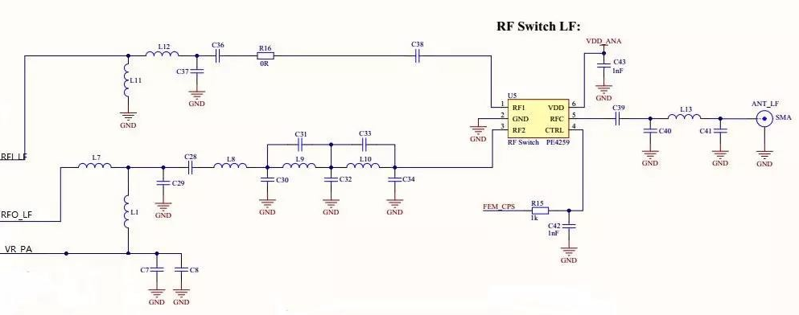
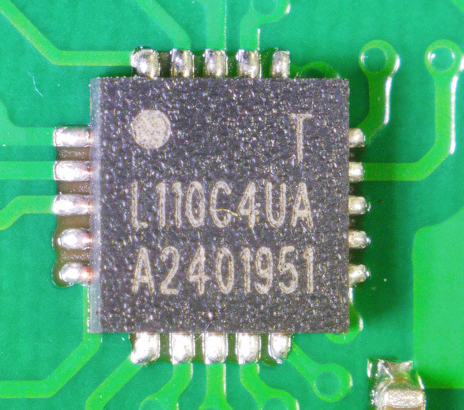

# Набор различных утилит для отладки приемника AIS и не только

## Постановка задачи 
1. Провести сравнительный анализ доступных недорогих радиомодулей, способных принимать AIS сигнал и проводить аппаратную демодуляцию GMSK (очень не хочется писать/добавлять готовый демодулятор GMSK)
2. Провести эксперименты по приему AIS сигнала с отобранными 2-3 радиомодулями из п1 и выбрать наилучший вариант

## Окружение 
### Софт
* Операционная система Ubuntu Ubuntu 24.04.3 LTS
* Visual Studio Code v1.108.2 с Platformio v 3.3.4
* GNU Radio v3.10.9.2 (Python 3.12.3)
* [EasyEDA](https://easyeda.com/editor) онлайн IDE для разработки радиосхем
### Железо
* Плата esp32doit-devkit-v1 в качестве управляющего микроконтроллера

## Сравнение радиомодулей для AIS

Таблица 1. Список радиомодулей для AIS

| Плата | Радиочип | Встроенный MCU | Фото | Цена на начало 2026, руб | Комментарий |
|----|---|---|---|---|---|
| XL1278-SMT | [SX1278](datascheet/SX1278.pdf) | отсутствует |  | ~500 | ВЧ часть рассчитана на 433 МГц (плату на 169 МГц не получилось купить), чип поддерживает band3 137-175 МГц, чувствительность -117 дБм@4.8 кбит/с, ВЧ-ключ UPG2179TB (или его клон XA214-G4C) |
| [E30 170T20D](datascheet/E30-170T20D.pdf) от [Ebyte](https://www.cdebyte.com/products/E30-170T20D) | [SI4463](datascheet/Si4464_63_61_60.pdf) | клон STM |  | ~750 | Требует перепрошивки MCU, жестко прописана модуляция GFSK, управление через AT-команды по UART, поддерживает 148-173,5 МГц, чувствительность -121 дБм@1 кбит/с, мощность передатчика 100 мВт (20 дБм) |
| [E32 170T30D](datascheet/E32-170T30D.pdf) от [Ebyte](https://www.cdebyte.com/products/E32-170T30D/) | [SX1278](datascheet/SX1278.pdf) | клон STM |  | ~1000 | Требует перепрошивки MCU, жестко прописана модуляция LoRa, управление через AT-команды по UART, поддерживает 160-173 МГц, чувствительность -147 дБм@2,4 кбит/с при модуляции LoRa, мощность передатчика 1 Вт (30 дБм) |

Разумеется, список далеко не полный, отбирал наиболее доступные недорогие радиомодули, к которым был интерес "потрогать в живую"

Есть ещё неплохой по характеристикам чип [Radiometrix NRX1](https://www.radiometrix.com/product/nrx1) и [Radiometrix RX1](https://www.radiometrix.com/product/rx1/), но в них нет аппаратной GMSK демодуляции, а добавлять еще модули или делать программную демодуляцию GMSK не очень хочется.

Есть интересная линейка чипов [AX5043](https://www.onsemi.com/download/data-sheet/pdf/ax5043-d.pdf), [AX5243](https://www.onsemi.com/download/data-sheet/pdf/ax5243-d.pdf), [AX8052](https://www.onsemi.com/download/data-sheet/pdf/ax8052f143-d.pdf) от [Onsemi](https://www.onsemi.com/) с хорошей чувствительностью, нужным частотным диапазоном и GMSK демодулятором, но готовых плат/модулей на их основе мне найти не удалось.

На базе платы E30 170T20D с радиочипом [SI4463](https://www.silabs.com/documents/public/data-sheets/Si4463-61-60-C.pdf) от Silicon Laboratories [AIS приемник](https://san.net.ru/ais/receiver.html) сделал [Андрей Сычев](https://san.net.ru/index.php) и даже поделился [прошивкой MCU](https://san.net.ru/ais/receiver-add.html). Андрей в своей статье написал, что не особо доволен чувствительностью приемника. На этом же радиочипе SI4463 построена плата [RF4463PRO](https://ru.nicerf.com/fsk-front-end-module/868mhz-rf-module-rf4463pro.html), выпускается на разные диапазоны, но найти доступную плату на 150 МГц не получилось.

Попробуем альтернативу на радиочипе [SX1278](https://www.semtech.com/products/wireless-rf/lora-connect/sx1278) от [Semtech](https://www.semtech.com) (на начало 2026 сайт в РФ не работает без VPN). Вообще, есть целая серия трансиверов SX1276, SX1277, SX1278 и SX1279. Различаются, по сути, верхней граничной частотой: у SX1278 она наименьшая 525 МГц и отсутствуют ВЧ-вход/выход для частот ~800-900 МГц (корпус у всех чипов SX1276/7/8/9 QFN-28, у SX1278 ВЧ-пины 21 и 22 посажены на GND). Так же есть трансиверы SX1261 и SX1262 (SX1262 немного мощнее), работающие в диапазоне 150–960 МГц и современные LLCC68 и LR1110 с аналогичным диапазоном 150–960 МГц, краткий обзор [тут](https://wireless-e.ru/lorawan/novinki-dlya-tehnologii-lora/). Найти готовы платы на нужный частотный диапазон так же не получилось.

Какие есть варианты в моем случае:
1. Поменять ВЧ-обвязку на плате XL1278-SMT для работы на частоте ~162 МГц
2. Перепрошить MCU на плате E32 170T30D для работы с сигналом AIS (настройка на частоту AIS, демодуляция GMSK, синхронизация по преамбуле и тп), по аналогии, как это делал Андрей Сычев для платы E30 170T20D
3. Подключиться и управлять напрямую радиочипом SX1278 на плате E32 170T30D, минуя внутренний MCU самой платы, что то подобное обсуждали на [форуме vrtp.ru](https://vrtp.ru/index.php?s=4305ffd8feb0a09dda4789e448f1d7b7&showtopic=32873&st=0&#entry952403)
4. Креативные варианты, по типу поставить преобразователь частоты с 162 на 433 МГц, пока рассматривать не будем 

### 1. Модернизация ВЧ-обвязки на плате XL1278-SMT
Примерно так может выглядеть ВЧ-часть на платах XL1278-SMT и E32 170T30D:

* RFI_LF (пин 1) - ВЧ-вход приемника SX1278
* RFO_LF (пин 28) - ВЧ-выход передатчика SX1278
* VR_PA (пин 25) - регулятор питания ВЧ-усилителя мощности
* ВЧ-ключ PE4259, по распиновке такой же, как и XA214-G4C и со схожими характеристиками

Схема взята [отсюда](https://www.cdebyte.com/news/6). Схема ВЧ-части из референсного AppNote производителя радиочипа выглядит еще боле навороченной, но по сути близка к показанной выше. Из плюсов - есть указания номиналов ёмкостей и индуктивностей фильтров, что потенциально немного облегчает воспроизведение схемы. Пока отложим про запас этот вариант.

### 2. Перепрошивка MCU на плате E32 170T30D 

Аккуратно отпаиваем экран с платы E32 170T30D:

и видим неизвестный китайский микроконтроллер L110C4UA: 

Опознать чип по маркировке L110C4UA могучие LLM не смогли, но Google отлично справился и мы понимаем, что это [HC32L110C4UA](datascheet/HC32L110SeriesDatasheet_Rev2.70.pdf) китайский 32-битный ARM® Cortex от [Xiaohua Semiconductor](https://www.xhsc.com.cn). Прошивки для данного MCU и плат E-byte можно посмотреть у [PenguinLRS](https://github.com/Penguin096/PenguinLRS)

Обдумав варианты, решил сначала отладить гибрид - подключить плату XL1278-SMT к ESP32 и научиться конфигурировать радиочип SX1278 из ESP32: 
1) это не требует аппаратных переделок плат 
2) esp32 мне знаком, не раз уже программировал под разные задачи 
3) разбираться одновременно и с новым для меня MCU HC32L110C4UA (как показал быстрый обзор MCU без особой документации, готовых тулчейнов под знакомые мне инструменты аля VS Code&Platformio нет) и с радиочипом SX1278 мне будет достаточно сложно

Наиболее перспективными библиотеками для управления SX127x из ESP32 мне показались две:
1) библиотека [RadioLib](https://github.com/jgromes/RadioLib) драйверов для различных радиочипов, включая SX1278, под разные платформы, включая esp3. Заточена под Arduino, но есть примеры и [под ESP-IDF](https://github.com/jgromes/RadioLib/tree/master/examples/NonArduino/ESP-IDF)
2) библиотека [SX127x под ESP-IDF](https://components.espressif.com/components/dernasherbrezon/sx127x/versions/5.0.1/readme) от dernasherbrezon с полным контролем управляющих регистров
   
Разумеется, есть и другие библиотеки для SX127x, но они или "заточены" под LoRa (а мне нужен GMSK) или только под Arduino (как программный фреймворк, а не плату как таковую) либо хуже "дружат" с ESP32. Либо я их не нашёл.    

## Полезные ссылки
1. [AIS приемник](https://san.net.ru/ais/receiver.html) Андрея Сычева на базе платы E30 170T20D (радиочип SI4463)
2. [AIS приемник](https://github.com/IDeTIC-AIS/RX-AIS) на базе радиочипа [Radiometrix RX1](https://www.radiometrix.com/product/rx1/)
3. [Github проект прошивки HC32L110 от PenguinLRS](https://github.com/Penguin096/PenguinLRS)
4. [Библиотека RadioLib драйверов различных радиочипов, включая SX1278, для разных платформ, включая esp3](https://github.com/jgromes/RadioLib)
5. [Библиотека SX127x под ESP-IDF от dernasherbrezon](https://components.espressif.com/components/dernasherbrezon/sx127x/versions/5.0.1/readme)
